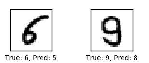

# Neural Network Verifier

A verifier for neural networks based on DeepPoly convex relaxation. This project evaluates robustness across various architectures and datasets (MNIST, CIFAR-10).

For more details about the underlying methodology, refer to the [DeepPoly paper](https://files.sri.inf.ethz.ch/website/papers/DeepPoly.pdf).

---

## Project Description

This project aims to verify the robustness of trained neural networks against adversarial perturbations within a specified radius in the L∞ norm ball. Specifically, it assesses whether a network maintains consistent output classifications when inputs are subjected to small perturbations, ensuring reliability in uncertain environments.

### Adversarial attacks

Consider a neural network trained to recognize handwritten digits from the MNIST dataset. Networks that are not specifically trained with adversarial training is very likely to be non-robust under adversarial attack. The attack can be in the form of pixel pertubation where the attacker pertubes the value of the pixels in the original by a small amount that leads the network to misclassify the image. Consider the example below:



Adversarial attack example. Source: [Research Gate](https://www.researchgate.net/figure/Adversarial-attack-causing-miss-classification-in-MNIST-data-set_fig1_322950125)


The verifier evaluates if the network consistently classifies to the same class when subjected to perturbations within a defined L∞ norm radius (e.g., ε = 0.01). If the network's output remains unchanged for all perturbed inputs within this radius, the network is considered robust for this input.

---

### Neural network verifier
This project implements a simple version of a network verifier that works with fully conencted, convolution, and residual layers with ReLU and ReLU6 activation. The key idea is to maintain a set of linear bounds for each neuron through each forward pass per layer. Using the linear bounds, we can compute the range of the output of the final layers, then compare them to verify the network.

---

## Folder Structure

- **`code/`**  
  - `networks.py`: Defines network architectures (uses `MLP.py` and `skip_block.py`).
  - `verifier.py`: Verifier implementation (modify the `analyze` function).
  - `evaluate.sh`: Evaluates all models and test cases.
  - `utils/`: Helper methods for loading and initialization.

- **`models/`**  
  Contains pretrained network weights.

- **`test_cases/`**  
  Includes ground truth (`gt.txt`) and 2 test cases per model.

---

## Setup

Using virtualenv:  
```bash
virtualenv venv --python=python3.10
source venv/bin/activate
pip install -r requirements.txt
